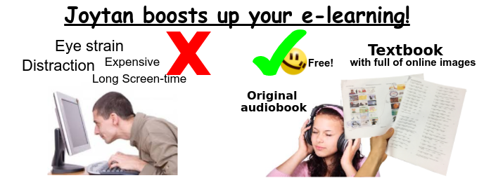
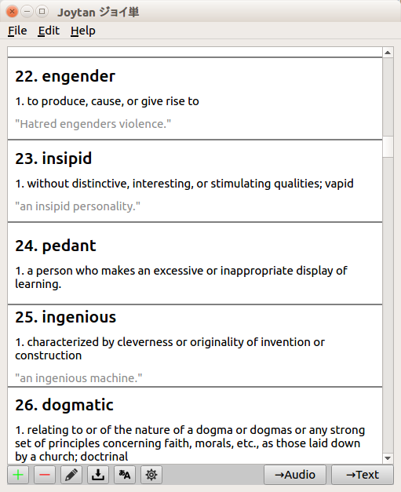
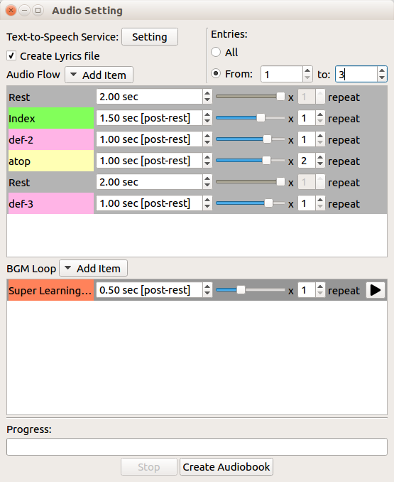
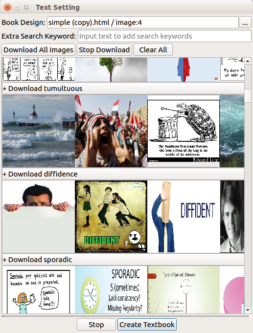

## Joytan ジョイ単


**Website**: https://kokimame.github.io/joytan/

[](https://travis-ci.org/kokimame/joytan)
[](https://gitter.im/JoytanApp/Lobby)
[](https://www.gnu.org/licenses/gpl-3.0)
[](https://twitter.com/intent/follow?screen_name=JoytanApp)

<p align="center">
  <a href="./docs/images/app_pros.png">
    
  </a>
</p>

Joytan is a free, small cross-platform desktop app that facilitates the process of making audio/textbooks.
It comes with some powerful features which are specially designed to be useful for language learners.

Key features include:
- **MP3 audiobooks with your best-loved songs and sound effects**
- **Lifelike speech using [Amazon Polly](https://aws.amazon.com/polly/) (24 languages in 52 voices)**
- **High-quality HTML/PDF textbooks (and quiz)**
- **Saving data as CSV files, ready to export to [Anki](https://apps.ankiweb.net)**
- **Google Image download (a ton of visual aids)**
- **Various online dictionary lookups**
- **[Memrise](https://www.memrise.com/) download**
- **10,000+ ready-to-convert sample entries (from [Duolingo](https://www.duolingo.com/),
 Memrise, etc) [here](https://drive.google.com/drive/u/0/folders/1tbAViNauTU4Pdl7il0AV-6FajYUIimas)**
- Support for local Text-to-Speech alternatives (eSpeak, say, etc)
- Original design of textbooks with basic HTML
- Data format editable on Google Sheets
- Language translation powered by Google Translation
- Self-made editable pattern of audiobooks
- Simple and tiny GUI, just 3 main dialogs!


## What You See
<!-- Screenshots of dialogs -->
<figure>
  <a href="./docs/images/main_full.png">
    
  </a>
</figure>
<figure>
  <a href="./docs/images/audio_full.png">
    
  </a>
</figure>
<figure>
  <a href="./docs/images/text_full.png">
    
  </a>
</figure>


## What You Get
We are distributing some of sample creations on [YouTube](https://www.youtube.com/channel/UC0bLbtTI9uni3bNRPIJQAqA). Take a look!

**Audiobook Sample:**

<a href="https://www.youtube.com/watch?v=tEIpgTREexQ">
  
</a>
<a href="https://www.youtube.com/watch?v=ehkQu1mKyeU">
  
</a>

[**See Textbook Sample (compressed)**](https://drive.google.com/open?id=15_k1pJdWzUldhL9HYP6vAOllSqAIjaHr)

[**See Matching Quiz Sample**](https://drive.google.com/open?id=124X0_d2It0MKF0HauGMq2SuOCEyrzn-t)


*NOTE: Videos were created from two resources. One is audiobooks which were
 created with Joytan, the other is image clips which were created separately from the app.
 Video-making feature is not included in the current version of Joytan.*

## Download & Installation
Joytan works on Windows, Mac, and Linux.

Please download & install Joytan from [our website](https://kokimame.github.io/joytan/install.html
) or [releases](https://github.com/kokimame/joytan/releases).

## Quick Start
Tutorials are available on [our website](https://kokimame.github.io/joytan/index.html).
- [Set up Amazon Polly](https://kokimame.github.io/joytan/tutorial.html)
- [How to Organize for your book](https://kokimame.github.io/joytan/tutorial_input.html)
- [How to Make Audiobooks](https://kokimame.github.io/joytan/tutorial_audio.html)
- [How to Make Textbooks](https://kokimame.github.io/joytan/tutorial_text.html)


## Development
Joytan requires:
- Python 3.5+
- PyQt that supports Qt 5.9+
- ffmpeg (Pydub's dependency, it may work with 'libav' but not tested)
- lame (AwesomeTTS's dependecy)

and a number of Python packages, which you can install via pip:
```
pip3 install -r requirements.txt
```

To use the development version:

```
git clone https://github.com/kokimame/joytan.git
cd joytan
./devscript/build_ui.sh
```

If you get any errors, you will not be able to proceed, so please return to
the top and check the requirements again.

Now you are ready to run Joytan by:
```
./runapp
```


## Contribution
- Report a bug: See [issues](https://github.com/kokimame/joytan/issues)
- Feature/Content request and feedback on [Twitter](https://twitter.com/JoytanApp), 
[YouTube](https://www.youtube.com/channel/UC0bLbtTI9uni3bNRPIJQAqA) are appreciated.


## Disclaimer
Copyright © 2017-Present Kohki Mametani (kohkimametani@gmail.com).

Joytan is lincensed under the GNU General Public License version 3.

THE SOFTWARE IS PROVIDED "AS IS", WITHOUT WARRANTY OF ANY KIND, EXPRESS OR IMPLIED,
INCLUDING BUT NOT LIMITED TO THE WARRANTIES OF MERCHANTABILITY,
FITNESS FOR A PARTICULAR PURPOSE AND NONINFRINGEMENT.
IN NO EVENT SHALL THE AUTHORS OR COPYRIGHT HOLDERS BE LIABLE FOR ANY CLAIM, DAMAGES
OR OTHER LIABILITY, WHETHER IN AN ACTION OF CONTRACT, TORT OR OTHERWISE,
ARISING FROM, OUT OF OR IN CONNECTION WITH THE SOFTWARE OR THE USE OR OTHER DEALINGS IN THE SOFTWARE.
